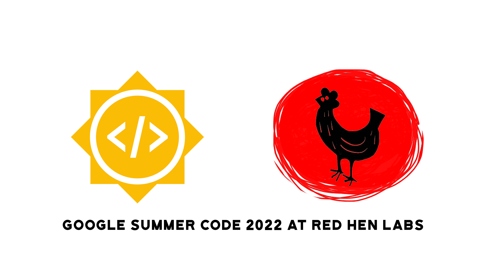

<!-- PROJECT SHIELDS -->
<!--
*** I'm using markdown "reference style" links for readability.
*** Reference links are enclosed in brackets [ ] instead of parentheses ( ).
*** See the bottom of this document for the declaration of the reference variables
*** for contributors-url, forks-url, etc. This is an optional, concise syntax you may use.
*** https://www.markdownguide.org/basic-syntax/#reference-style-links
-->
<!-- [![Contributors][contributors-shield]][contributors-url]
[![Forks][forks-shield]][forks-url]
[![Stargazers][stars-shield]][stars-url]
[![Issues][issues-shield]][issues-url]
[![MIT License][license-shield]][license-url]
[![LinkedIn][linkedin-shield]][linkedin-url]
[![Youtube][youtube-shield]][youtube-url]
 -->

<!-- PROJECT LOGO -->
<br />
<div align="center">
	<a href="https://github.com/Harsh188/GSoC-RedHenLab-MTVSS-2022">
		
	</a>
</div>

# Google Summer of Code 2022: Final Work Product

<!-- TABLE OF CONTENTS -->
<details>
  <summary>Table of Contents</summary>
  <ol>
    <li>
      <a href="#about-the-project">About The Project</a>
    </li>
    <li>
      <a href="#getting-started">Getting Started</a>
      <ul>
        <li><a href="#prerequisites">Prerequisites</a></li>
        <li><a href="#installation">Installation</a></li>
      </ul>
    </li>
    <li><a href="#contributing">Contributing</a></li>
    <li><a href="#license">License</a></li>
    <li><a href="#contact">Contact</a></li>
    <li><a href="#acknowledgments">Acknowledgments</a></li>
  </ol>
</details>


## About The Project


### **Organization**: Red Hen Lab
### **Mentors**:
- Frankie Robertson ([@frankier](https://github.com/frankier/)) - Primary
- Tim Groeling
- Francis Steen

### **Aim**
This proposal proposes a multi-modal multi-phase pipeline to tackle television show segmentation on the Rosenthal videotape collection. The two-stage pipeline will begin with feature filtering using pre-trained classifiers and heuristic-based approaches. This stage will produce noisy title sequence segmented data containing audio, video, and possibly text. These extracted multimedia snippets will then be passed to the second pipeline stage. In the second stage, the extracted features from the multimedia snippets will be clustered using RNN-DBSCAN. Title sequence detection is possibly the most efficient path to high precision segmentation for the first and second tiers of the Rosenthal collection (which have fairly structured recordings). This detection algorithm may not bode well for the more unstructured V8+ and V4 VCR tapes in the Rosenthal collection. Therefore the goal is to produce accurate video cuts and split metadata results for the first and second tiers of the Rosenthal collection.

### **Implementation**
TODO:

### **Progress**
<!-- ROADMAP -->
#### Roadmap

- [x] Community Bonding
- [x] Pipeline Stage One
	- [x] Audio Extraction
	- [x] Perform music segmentation
	- [x] Extract keyframes
	- [x] Manually annotate title sequences
	- [x] Train keyframe classifier
- [x] Evaluation 1
- [ ] Pipeline Stage Two
    - [ ] RNN-DBSCAN Clustering
    - [ ] Create video splits
- [ ] Final Evaluation

See the [open issues](https://github.com/harsh188/GSoC-RedHenLab-MTVSS-2022/issues) for a full list of proposed features (and known issues).

### **Work Done**

#### Phase 1

#### Phase 2

### **What's Next?**
TODO:
### **Challenges**
TODO:
### **Learnings**
TODO:

<p align="right">(<a href="#top">back to top</a>)</p>


## Getting Started

### Local Development (Docker)

1. To build the docker image run the following command

```
docker-compose up
```

This command builds the docker image which can then be used to start up the container.

2. Next use the following command to start up the docker container

```
docker run --gpus all -it --rm -p 8888:8888 -v $PWD:/MultiModalTVShowSeg-2022 redhenlab-multimodal_tv_show_segmentation_dev
```

Once the container is up and running use the following code to launch jupyter notebooks.

```
jupyter notebook --ip 0.0.0.0 --no-browser --allow-root
```


<p align="right">(<a href="#top">back to top</a>)</p>

<!-- CONTRIBUTING -->
## Contributing

Contributions are what make the open source community such an amazing place to learn, inspire, and create. Any contributions you make are **greatly appreciated**.

If you have a suggestion that would make this better, please fork the repo and create a pull request. You can also simply open an issue with the tag "enhancement".
Don't forget to give the project a star! Thanks again!

1. Fork the Project
2. Create your Feature Branch (`git checkout -b feature/AmazingFeature`)
3. Commit your Changes (`git commit -m 'Add some AmazingFeature'`)
4. Push to the Branch (`git push origin feature/AmazingFeature`)
5. Open a Pull Request

<p align="right">(<a href="#top">back to top</a>)</p>

<!-- LICENSE -->
## License

Distributed under the MIT License. See [`LICENSE`](https://github.com/harsh188/GSoC-RedHenLab-MTVSS-2022/blob/master/LICENSE) for more information.

<p align="right">(<a href="#top">back to top</a>)</p>

<!-- CONTACT -->
## Contact

Harshith Mohan Kumar - [@harsh188](https://www.linkedin.com/in/harsh188/) - harshithmohankumar@pesu.pes.edu

Project Link: [https://github.com/Harsh188/GSoC-RedHenLab-MTVSS-2022](https://github.com/Harsh188/GSoC-RedHenLab-MTVSS-2022)

<p align="right">(<a href="#top">back to top</a>)</p>


<!-- MARKDOWN LINKS & IMAGES -->
<!-- https://www.markdownguide.org/basic-syntax/#reference-style-links -->
[contributors-shield]: https://img.shields.io/github/contributors/Harsh188/repo.svg?style=for-the-badge
[contributors-url]: https://github.com/Harsh188/GSoC-RedHenLab-MTVSS-2022/graphs/contributors
[forks-shield]: https://img.shields.io/github/forks/Harsh188/repo.svg?style=for-the-badge
[forks-url]: https://github.com/Harsh188/GSoC-RedHenLab-MTVSS-2022/network/members
[stars-shield]: https://img.shields.io/github/stars/Harsh188/repo.svg?style=for-the-badge
[stars-url]: https://github.com/Harsh188/GSoC-RedHenLab-MTVSS-2022/stargazers
[issues-shield]: https://img.shields.io/github/issues/Harsh188/repo.svg?style=for-the-badge
[issues-url]: https://github.com/Harsh188/GSoC-RedHenLab-MTVSS-2022/issues
[license-shield]: https://img.shields.io/github/license/harsh188/repo.svg?style=for-the-badge
[license-url]: https://github.com/harsh188/GSoC-RedHenLab-MTVSS-2022/blob/master/LICENSE
[linkedin-shield]: https://img.shields.io/badge/-LinkedIn-black.svg?style=for-the-badge&logo=linkedin&colorB=555
[linkedin-url]: https://www.linkedin.com/in/harsh188/
[youtube-shield]: https://img.shields.io/badge/YouTube-FF0000?style=for-the-badge&logo=youtube&logoColor=white
[youtube-url]: https://www.youtube.com/channel/UCFpda-r5V_aHpBVgYhm_JDA