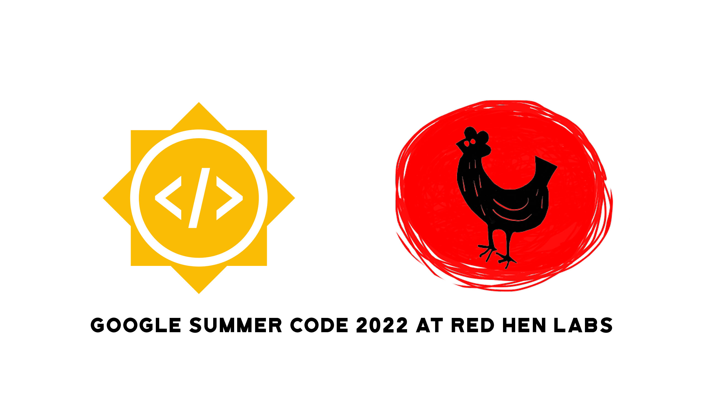
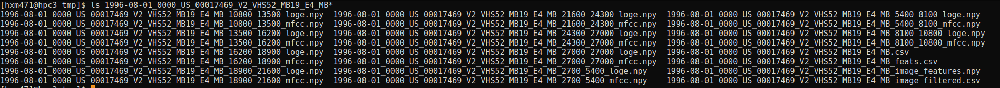
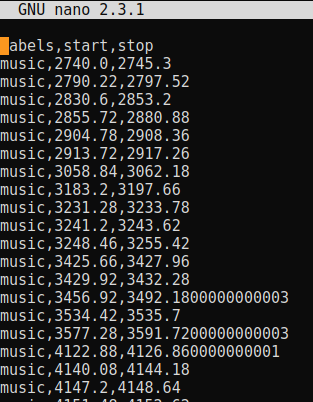

<!-- PROJECT SHIELDS -->
<!--
*** I'm using markdown "reference style" links for readability.
*** Reference links are enclosed in brackets [ ] instead of parentheses ( ).
*** See the bottom of this document for the declaration of the reference variables
*** for contributors-url, forks-url, etc. This is an optional, concise syntax you may use.
*** https://www.markdownguide.org/basic-syntax/#reference-style-links
-->
<!-- [![Contributors][contributors-shield]][contributors-url]
[![Forks][forks-shield]][forks-url]
[![Stargazers][stars-shield]][stars-url]
[![Issues][issues-shield]][issues-url]
[![MIT License][license-shield]][license-url]
[![LinkedIn][linkedin-shield]][linkedin-url]
[![Youtube][youtube-shield]][youtube-url]
 -->

<!-- PROJECT LOGO -->
<br />
<div align="center">
	<a href="https://github.com/Harsh188/GSoC-RedHenLab-MTVSS-2022">
		
	</a>
</div>

# Google Summer of Code 2022: Final Work Product

<!-- TABLE OF CONTENTS -->
<details>
  <summary>Table of Contents</summary>
  <ol>
    <li>
      <a href="#about-the-project">About The Project</a>
      <ul>
          <li><a href="#aim">Aim</a></li>
          <li><a href="#written-materialdocumentation">Written Material/Documentation</a></li>
          <li><a href="#roadmap">Roadmap</a></li>
          <li><a href="#work-done">Work Done</a></li>
          <ul>
            <li><a href="#phase-1">Phase-1</a></li>
            <li><a href="#phase-2">Phase-2</a></li>
            <li><a href="#final-analysis">Final Analysis</a></li>
          </ul>
          <li><a href="#challenges">Challenges</a></li>
          <li><a href="#learnings">Learnings</a></li>
          <li><a href="#whats-next">What's Next?</a></li>
      </ul>
    </li>
    <li>
      <a href="#getting-started">Getting Started</a>
      <ul>
        <li><a href="#prerequisites">Prerequisites</a></li>
        <li><a href="#installation">Installation</a></li>
      </ul>
    </li>
    <li><a href="#contributing">Contributing</a></li>
    <li><a href="#license">License</a></li>
    <li><a href="#contact">Contact</a></li>
    <li><a href="#acknowledgments">Acknowledgments</a></li>
  </ol>
</details>


## About The Project

### **Organization**: Red Hen Lab
### **Mentors**:
- Frankie Robertson ([@frankier](https://github.com/frankier/)) - Primary
- Tim Groeling
- Francis Steen

### **Aim**
This proposal proposes a multi-modal multi-phase pipeline to tackle television show segmentation on the Rosenthal videotape collection. The two-phase pipeline begins with feature filtering using pre-trained classifiers and heuristic-based approaches. The first phase produce noisy title sequence segmented data containing audio, and annotated keyframes. These extracted snippets are then passed to the second pipeline phase. In the second phase, the extracted features from the keyframe images are clustered using RNN-DBSCAN. Title sequence detection is possibly the most efficient path to high precision segmentation for the first and second tiers of the Rosenthal collection (which have fairly structured recordings). This detection algorithm may not bode well for the more unstructured V8+ and V4 VCR tapes in the Rosenthal collection. Therefore the goal is to produce accurate video cuts and split metadata results for the first tier of the Rosenthal collection.

### **Written Material/Documentation**

As part of the Google Summer of Code application process, I had to create a detailed documentation listing out my project proposal for GSoC'22. This project proposal document can be found [here](https://drive.google.com/file/d/1tKNN-ujqXIQTCx1NIL2mA_ksoE-tX4gr/view?usp=sharing).This document contains a detailed description of the problem statement, dataset and my proposed pipeline.

In addition to this GitHub repository, I've maintained an extensive collection of weekly blog posts on my Medium acount. This [introductory article](https://harsh188.medium.com/gsoc-red-hen-lab-week-1-community-bonding-period-22dcce90a5e2) contains links to the goals, work done and conclusion for each week.

During week 6, which marks the midway through the GSoC coding phase, I created a visual presentation to present to all my mentors which can be found [here](https://drive.google.com/file/d/1hNDlbGv8eB_Kburo9_nT9dzPh6PL666q/view?usp=sharing).

### **Progress**
<!-- ROADMAP -->
#### Roadmap

- [x] Community Bonding
- [x] Pipeline Stage One
	- [x] Audio Extraction
	- [x] Perform music segmentation
	- [x] Extract keyframes
	- [x] Manually annotate title sequences
	- [x] Train keyframe classifier
- [x] Evaluation 1
- [x] Pipeline Stage Two
    - [x] RNN-DBSCAN Clustering
- [x] Final Evaluation

### **Work Done**

#### Phase-1

The first phase is what I would call a "feature filtering" process for the second phase. In more descriptive terms, the first phase will first run through a pre-trained music classifier and then filter false positives using a fine-tuned ResNet50V2 image-based keyframe classifier to identify and extract the title sequence boundary time of each program. This extracted noisy data is then fed to clustering algorithms grouped by modalities.

For the pre-trained audio classifier, I utilized the [inaSpeechSegmenter](https://github.com/ina-foss/inaSpeechSegmenter) open-source library. However, the code had suboptimal performance on long and abundant MP4 files. For this reason, I made drastic improvements to the library by introducing multithreading and input file splitting. Additionally, I made incremental changes to the generator function for improved performance. Overall, the increase in efficiency and performance was twofold and allowed me to process the Rosenthal collection with relative speed.

Moving on, I further optimized my pipeline by implementing producer-consumer threads, which allow for efficient memory usage on the compute nodes. With my producer thread queue size set to 8, I was able to download and process the mp4 files in parallel with sufficient memory. To assure the quality and reusability of my code, I integrated multiple checks to ensure that the process would not be repeated on already segmented files.

After extracting the audio features and music segmentation timestamps from the mp4 files, I moved on to the second stage of phase 1. In this stage, I extracted and manually annotated approximately 4000 images into three different classes: "commercial, title sequence, and unknown". I further extracted an additional 1000 images from the commercial CSV data provided by Professor Tim Groeling in an experiment conducted through UCLA. In total, my image dataset consisted of about 4000 images split between commercial and title sequence labels.

Then I fine-tuned a pre-trained ResNet50V2 from Keras by training the appended top most dense layers using the manually annotated data. The validation accuracy of the model reached an astonishing 90%. For a real-world application, these accuracy levels were adequate for the work at hand. By saving the weights, I integrated the model as part of the phase-1 pipeline to filter out the unkown "commercials" generated by the music segmentation.

#### Phase-2

The second phase pertains to organizing and further filtering the features extracted from the image classification stage through the use of clustering. More specifically, the algorithm of choice is [RNN-DBSCAN](https://ieeexplore.ieee.org/abstract/document/8240674).

RNN-DBSCAN is a clustering algorithm that uses reverse nearest neighbor counts. It's built to withstand large variations in cluster density and utilizes only one parameter (choice of n nearest neighbors). I have utilized an open source implementation built by [@frankier](https://github.com/frankier/) which can be found here: [sklearn-ann](https://github.com/frankier/sklearn-ann).

I first tried to cluster the entire courpus of features, which was approximately `(7,000,000, 2048)` in size. Unfortunately, this is where I ran into hardware limitations, as either the array would be too large to load into memory or utilizing mmaps was overloading the page tables. To overcome this issue, I tried two alternatives.

Firstly, I used a much smaller subset to run the clustering algorithm. This subset consisted of a few hundred thousand features. Initially, I created these subsets using the same day of the week across a year in hopes of finding similar shows and features. Upon consulting with Professor Tim Groeling, I then changed the subset to include the start and stop dates extracted from the Rosenthal VCR Settings sheet. This spreadsheet consisted of a few start and stop dates during which the same VCR settings were used.

The other approach, advised by Frankie, was to stream the features as bytes into a binary file and then open the final binary file with all of the features as one mmaped array. However, due to a lack of time, I was not able to fully integrate this suggestion.

#### Final Analysis

Since the pipeline is split into multiple stages, each working on its own modality, coming up with one metric to evaluate the entire pipeline is quite difficult. For this reason, the individual stages have been evaluated independently from one another.

In addition to the quantitative analysis I will be including screenshots of the outputs across the different stages to visually illustrate how the metadata evolves over the various systems. Firstly, the screenshot depicted below is a screenshot of the various metadata collected for the file `1996-08-01_0000_US_00017469_V2_VHS52_MB19_E4_MB.mp4`.


Fig.1 - Metadata output. <br/><br/>

The metadata in the screenshot above contains `[loge,mfcc,csv,feats.csv,image_features,image_filtered.csv]`. The first four elements in this list pertain to the outputs obtained from stage-1. 

Starting with the music segmentation stage, I believe that this is one of the most confident stages in the pipeline. The model used won the [MIREX 2018 Music and Speech Detection task](https://www.music-ir.org/mirex/wiki/2018:Music_and_or_Speech_Detection_Results) and has a segment-level precision of `90.5%`. Now the screenshot below of `1996-08-01_0000_US_00017469_V2_VHS52_MB19_E4_MB.csv` shows the structure in which I've stored the timestamps. It has three columns `[labels,start,stop]` where the start and stop timestamps indicate the presence of music.


Fig.2 - Music segmentation output.<br/><br/>

Next, we move onto the image classification model. The base pre-trained ResNet50V2 model was taken from Keras, which reports that it has a top-5 accuracy of `93%`. Since I fine-tuned the model, I introduced a softmax layer to record the confidence of the predictions made by the model for each class. The confidence of these classifications was highly variable, and for that reason, I filtered out images with confidence values of less than `95%`.


Fig.3 - Accuracy vs Epoch for the image classifier.<br/><br/>


Fig.4 - Loss vs Epoch for the image classifier.<br/><br/>

In the previous output of `1996-08-01_0000_US_00017469_V2_VHS52_MB19_E4_MB.csv` depicted in `Fig.1` we saw the start and stop range for music intervals. Now utilizing that range, I extract five images from each interval. In the screenshot below, each row represents the five keyframes from one music interval.


Fig.5 - Keyframes extracted from music segmentation intervals. <br/><br/>

**The following table depicts the accuracy for the stages in the first phase of the pipeline:**

| Stage       | Accuracy    |
| ----------- | ----------- |
| Stage-1 - Music Segmentation      | 90.5%       |
| Stage-2 - Image Classification    | 93-95%      |

Finally, the clustering stage, which in fact has been the hardest stage to evaluate due to its unsupervised nature. One of the most popular metrics to calculate the goodness of a clustering technique is the Silhouette coefficient. The results from the Silhouette coefficient metric were significantly low when evaluating the RNN-DBSCAN algorithm. The table below shows the results for various `N` neighbors used. By theory, low Silhouette coefficient scores indicate that the distance between the clusters is not significant. However, computing the standard statistical measures such as mean, median, mode, standard deviation and performing a visual cluster analysis paints a different picture on the performance of RNN-DBSCAN.

As Frankie noted in our of our meetings, relying on one metric doesn't provide a holistic understanding of what the algorithm is doing. This is especially evident in unsupervised algorithms where there is no "True" label to test the performance on. As observed in the table below, on average the median and mode of the clusters contain `five features` in each cluster. Since I extract exactly five keyframe images from each timestamp it makes sense that there are clusters with five images each.

**The following table lists out the various metrics used to measure performance of the clustering algorithm:**

| Stage       | Silhouette Coefficient    | N Neighbors | Mean | Median | Mode | Standard Deviation |
| ----------- | ----------- | ----------- | ----------- | ----------- | ----------- | ----------- |
| Phase-2 - RNN-DBSCAN | 0.3 | 2 | 6.92 | 4.0 | 3 | 202.87 |
| Phase-2 - RNN-DBSCAN | 0.216 | 3 | 10.78 | 5.0 | 5 | 307.90 |
| Phase-2 - RNN-DBSCAN | 0.187 | 4 | 16.66 | 5.0 | 5 | 606.35 |
| Phase-2 - RNN-DBSCAN | -0.103 | 5 | 36.88 | 9.0 | 6 | 1333.12 |

To get a visual understanding of what one of the clusters looks like, I handpicked a cluster and printed out all of the images within that cluster. In order to do this I had to get the indices of these images and then manually backtrack to the file and print out the keyframes. `Fig.6` shows the output for cluster 8 which contains `[61,62,63,64]`. I traced these images back and plotted them with an additional index `[65]` to contrast the previous images. This output can be observed in `Fig.7`.


Fig.6 - Keyframe indicies within cluster 8. <br/><br/>


Fig.7 - Mapped keyframes for indicies from Fig.6 with an addition of keyframe index 65. <br/><br/>

Overall, the statistical measures combined with the visual output of the RNN-DBSCAN clustering algorithm indicates the inaccurate measurement of Silhouette coefficient. The Silhouette coefficient includes the relationship between pairs which we already know to be in the same segment however, ideally these pairs should be excluded from consideration during the calculation.

### **Challenges**

(1) HPC Learning Curve

One of the first things I had to get myself used to was working with the Case Western Reserve University High Performance Computing (HPC) service. Prior to this project, I had never dealt with HPCs before and so there was a significant learning curve. There were a lot of things to tackle. It started off with small tasks like how I can get my code repositories synchronized between local and remote servers. Gradually, the problems I encountered started to become bigger and more daunting.

One of the most frustrating parts of my project was the lack of direct access to the Gallina directory through the GPU compute nodes. Since the GPU nodes didn't have the rds mount, I had to use rsync to copy over files prior to processing them. This not only slowed down my program but it also introduced an abundant of checks and conditions which I had to account for.

(2) Consumer/Producer Multithreading

Since this project deals with processing huge amounts of data, it had to be as efficient as possible. During the first few weeks of the coding phase, I spent a significant chunk of my time modifying the inaSpeechSegmenter library to incorporate multithreading. I additionally incorporated consumer-producer threads to ensure that the files which are being copied over to the GPU node did not result in an memory overflow. In doing this I was able to process 8 files at a time without overloading the memory.

(3) Output Tracing Across Files

During the <a href="#final-analysis">Final Analysis</a> section of this report I visually demonstrated the outputs across the various stages for the file `1996-08-01_0000_US_00017469_V2_VHS52_MB19_E4_MB`. I have manually collected and computed these index tracings. This is quite inefficient and prone to error. It has also inhibited me from gathering keyframs which span multiple files.

I often drop and manipulate the outputs in each metadata file and for that reason the indicies don't linearly translate across the various outputs. This is an inherent design flaw in the data pipeline. It is also one of the first features which needs to be fixed prior to working on the future additions proposed in the <a href="#whats-next">What's Next?</a> section.

### **Learnings**
Overall, I've learned a significant amount throughout the time I've spent to develop this project. I have to give a huge thanks to my dear mentor [Frankie Robertson](https://frankie.robertson.name/), he helped elevate this project to great heights. He has consistently provided me with an abundant of relevant libraries, tutorials, papers and even got his hands dirty by helping me debugging issues that I'd be stuck on.

If I had to make a list of the tools/concepts I've learned during this project, it would be:
1. HPC
2. Multithreading/Multiprocess using Python
3. Audio Processing
4. Profiling
5. Job Scheduling + Array Jobs
6. Singularity
7. Scripting
8. ssh

### **What's Next?**

**Do you want to be part of Red Hen Lab!?** Well if this project interests you then you could work on improving this existing project since there are still a few features which could be implemented to make it better!

(1) Closed Captioning Exploration

This feature of using the text modality found in the closed caption files to help validatate and futher process the stage-2 outputs was one that I didn't have time to explore. I believe that by exploring these CC files through string matching by trying to find keywords used during transitions between shows would help analyze the structure of these mp4 files.

<!-- Professor Francis Steen futher suggested that we could essentially build algorithms like apriori which are goverened by a set of rules to process and analyze these stage-1 outputs. -->

(2) Image Classification Improvement

Additionally, another way to improve the results of the image classification stage is by increasing the size of the labeled dataset upon which the ResNet50V2 model trains on. By creating a larger dataset, it allows the model to fine-tune and converge better than before. Alternate image classification models could also be explored.

(2) RNN-DBSCAN Tuning & Validation

One area which I feel like I could have spent more time on is the clustering phase. Due to it's unsupervised black-box nature, it's hard to understand and explain what exactly is going on with the RNN-DBSCAN algorithm. However, from the results gathered in this report, there is a slight indication that the Silhouette Coefficient is not a good indicative measure of performance. For this reason, alternative custom validation metrics could be explored.

(3) GUI for UCLA annotators

Since this pipeline is built to annotate the Rosenthal collection, there is a great scope to help the UCLA annotators produce manual corrections/segmentations by using the metadata produced by this pipeline. A GUI or spreadsheet type feature which would allow these annotators to easily access the metatdata to speed up the labeling process. This feature would also have to introduce a more refined data collection and tracking process. The data collected across the various stages should be able to be mapped with the outputs from the previous or next stage.

(4) Multi-modal clustering:

Finally, one feature which I didn't have time to work on was including audio features into the RNN-DBSCAN clustering. A majority of the audio features have been collected and stored on gallina, therefore this data is available to be used for futher clustering. There is also a possibility to combine the image features and audio features during clustering.

<p align="right">(<a href="#top">back to top</a>)</p>


## Getting Started

### Local Development (Docker)

1. To build the docker image run the following command

```
docker-compose up
```

This command builds the docker image which can then be used to start up the container.

2. Next use the following command to start up the docker container

```
docker run --gpus all -it --rm -p 8888:8888 -v $PWD:/MultiModalTVShowSeg-2022 redhenlab-multimodal_tv_show_segmentation_dev
```

Once the container is up and running use the following code to launch jupyter notebooks.

```
jupyter notebook --ip 0.0.0.0 --no-browser --allow-root
```

### CWRU HPC Development

1. Log in to the Case Wester Reserve University HPC using your login credentials.
```
ssh xxxxxx@rider.case.edu
```

2. Ensure that the mtvss Singularity image exists, otherwise follow these steps:
```
module load singularity/3.8.1
singularity pull mtvss_dev#.sif docker://ghcr.io/harsh188/redhenlab-multimodal_tv_show_segmentation
```
For more information on Singularity visit the [Techne Public Site](https://sites.google.com/case.edu/techne-public-site/singularity)

3. Run interactive of batch jobs
```
sbatch --array=20-25 /mnt/rds/redhen/gallina/home/hxm471/RedHenLab-Multimodal_TV_Show_Segmentation/scripts/stage1/pipeline.slurm

or 

srun -p gpu -C gpu4v100 --mem=20gb --gres=gpu:1 --time=09:00:00 --pty bash
```
Check `/scripts` for more information on the job submissions and slurm files.

<p align="right">(<a href="#top">back to top</a>)</p>

<!-- CONTRIBUTING -->
## Contributing

Contributions are what make the open source community such an amazing place to learn, inspire, and create. Any contributions you make are **greatly appreciated**. Take a look at the <a href="#What's Next?">What's Next section</a> for features which you could work on!

See the [open issues](https://github.com/harsh188/GSoC-RedHenLab-MTVSS-2022/issues) for a full list of proposed features (and known issues).

If you have a suggestion that would make this better, please fork the repo and create a pull request. You can also simply open an issue with the tag "enhancement".
Don't forget to give the project a star! Thanks again!

1. Fork the Project
2. Create your Feature Branch (`git checkout -b feature/AmazingFeature`)
3. Commit your Changes (`git commit -m 'Add some AmazingFeature'`)
4. Push to the Branch (`git push origin feature/AmazingFeature`)
5. Open a Pull Request

<p align="right">(<a href="#top">back to top</a>)</p>

<!-- LICENSE -->
## License

Distributed under the MIT License. See [`LICENSE`](https://github.com/harsh188/GSoC-RedHenLab-MTVSS-2022/blob/master/LICENSE) for more information.

<p align="right">(<a href="#top">back to top</a>)</p>

<!-- CONTACT -->
## Contact

Harshith Mohan Kumar - [@harsh188](https://www.linkedin.com/in/harsh188/) - harshithmohankumar@pesu.pes.edu

Project Link: [https://github.com/Harsh188/GSoC-RedHenLab-MTVSS-2022](https://github.com/Harsh188/GSoC-RedHenLab-MTVSS-2022)

<p align="right">(<a href="#top">back to top</a>)</p>


<!-- MARKDOWN LINKS & IMAGES -->
<!-- https://www.markdownguide.org/basic-syntax/#reference-style-links -->
[contributors-shield]: https://img.shields.io/github/contributors/Harsh188/repo.svg?style=for-the-badge
[contributors-url]: https://github.com/Harsh188/GSoC-RedHenLab-MTVSS-2022/graphs/contributors
[forks-shield]: https://img.shields.io/github/forks/Harsh188/repo.svg?style=for-the-badge
[forks-url]: https://github.com/Harsh188/GSoC-RedHenLab-MTVSS-2022/network/members
[stars-shield]: https://img.shields.io/github/stars/Harsh188/repo.svg?style=for-the-badge
[stars-url]: https://github.com/Harsh188/GSoC-RedHenLab-MTVSS-2022/stargazers
[issues-shield]: https://img.shields.io/github/issues/Harsh188/repo.svg?style=for-the-badge
[issues-url]: https://github.com/Harsh188/GSoC-RedHenLab-MTVSS-2022/issues
[license-shield]: https://img.shields.io/github/license/harsh188/repo.svg?style=for-the-badge
[license-url]: https://github.com/harsh188/GSoC-RedHenLab-MTVSS-2022/blob/master/LICENSE
[linkedin-shield]: https://img.shields.io/badge/-LinkedIn-black.svg?style=for-the-badge&logo=linkedin&colorB=555
[linkedin-url]: https://www.linkedin.com/in/harsh188/
[youtube-shield]: https://img.shields.io/badge/YouTube-FF0000?style=for-the-badge&logo=youtube&logoColor=white
[youtube-url]: https://www.youtube.com/channel/UCFpda-r5V_aHpBVgYhm_JDA
